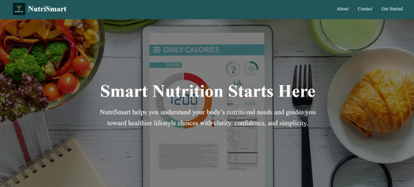
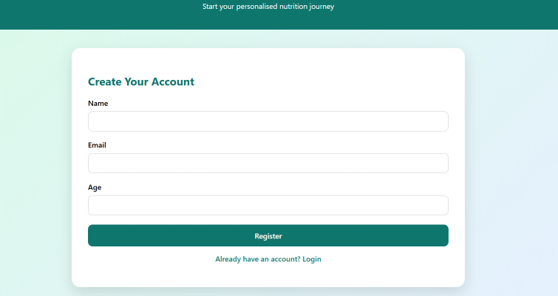
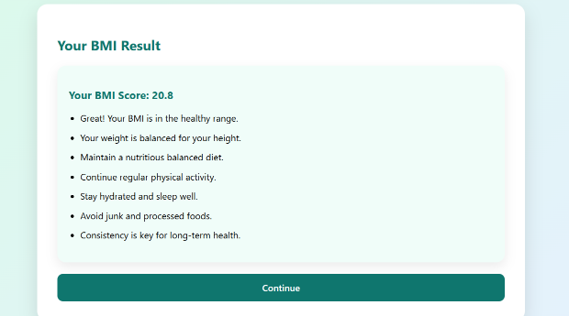
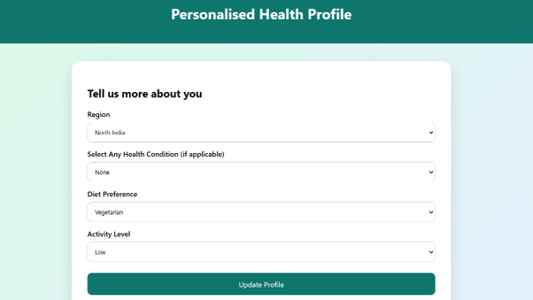
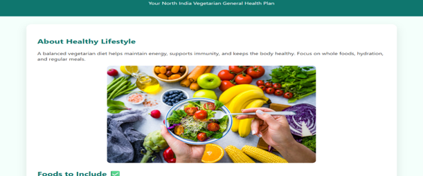
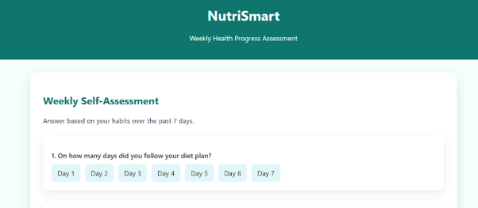
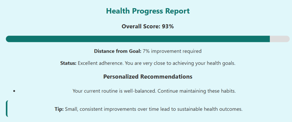
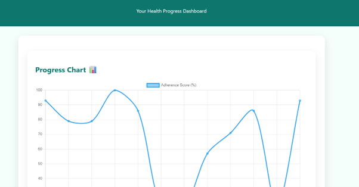

### 🥗 NutriSmart – Personalized Nutrition Web Application

#### 📌 Overview

NutriSmart is a full-stack web application that provides users with personalized nutrition recommendations based on their health profile, lifestyle, and dietary preferences. The application helps users understand their Body Mass Index (BMI), receive customized diet plans, and monitor their weekly health progress through assessments and visual analytics.

The project was developed using HTML, CSS, JavaScript, Node.js, Express.js, and MongoDB, providing a responsive and interactive user experience with secure user authentication.

---

### ✨ Features

* 👤 User Registration and Login
* 🔐 Secure Authentication
* 📏 BMI Calculator
* 🥗 Personalized Diet Recommendation
* 🏥 Health Condition Analysis
* 📊 Weekly Progress Tracking
* 📈 Progress Charts
* 💡 Personalized Health Tips
* 📱 Responsive User Interface

---

### 🛠️ Tech Stack

#### Frontend

* HTML5
* CSS3
* JavaScript

#### Backend

* Node.js
* Express.js

#### Database

* MongoDB

#### Other Tools

* Git
* GitHub

---

### 🚀 Application Workflow

#### Step 1 — User Authentication

Users can:

* Register a new account
* Login using existing credentials

The authentication system securely stores user information before allowing access to the application.


#### Step 2 — BMI Calculation

After logging in, users enter:

* Height
* Weight

The system calculates:

* Body Mass Index (BMI)
* BMI Category
* Basic Health Suggestions


#### Step 3 — Personalized Diet Planning

Users provide additional information such as:

* Dietary Preference
* Vegetarian / Non-Vegetarian
* Place of Residence
* Existing Medical Conditions
* Lifestyle Information

Based on these inputs, NutriSmart generates a personalized diet recommendation suitable for the user's profile.


#### Step 4 — Weekly Health Assessment

Users complete a short weekly questionnaire about their lifestyle and eating habits.

The assessment evaluates:

* Food Habits
* Exercise Consistency
* Water Intake
* Sleep Schedule
* Overall Health Routine


#### Step 5 — Progress Tracking

The application stores previous assessment scores and displays:

* Weekly Progress
* Performance Charts
* Improvement Trends
* Personalized Recommendations

This allows users to monitor their health journey over time.

---

### 📊 System Flow

```text
User
   │
   ▼
Register / Login
   │
   ▼
Enter Height & Weight
   │
   ▼
BMI Calculation
   │
   ▼
Enter Personal Details
   │
   ▼
Generate Personalized Diet Plan
   │
   ▼
Weekly Health Assessment
   │
   ▼
Progress Analysis
   │
   ▼
Charts + Health Tips
```

---

### 📸 Application Screenshots

#### 🏠 Home Page




#### 🔐 User Registration




#### 🔑 BMI Calculation and Result




#### 🥗 Personalized Diet Plan Detail Page



####  Personalized Diet Plan



#### 📝 Health Assessment




#### 📊 Weekly Progress Report 




#### 📈 Complete Progress Charts and Summaries



---

### 🎯 Future Enhancements

* 🤖 AI-powered nutrition recommendations
* 🔥 Daily calorie tracking
* 🏃 Exercise planner
* ⏰ Meal reminders
* 📱 Mobile application
* 💬 AI nutrition chatbot
* 📷 Food image recognition
* ⌚ Wearable device integration

---

### 👩‍💻 Author

**Sruthi Chaganti**

B.Tech Computer Science and Engineering
VIT-AP University

---

